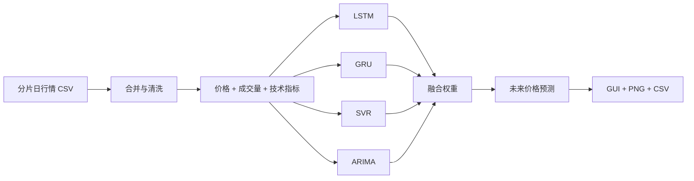
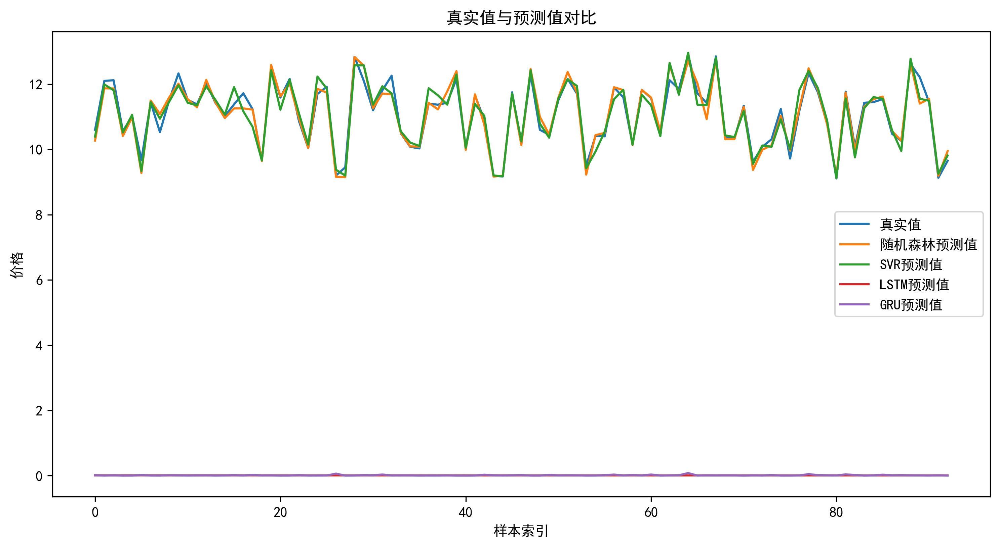
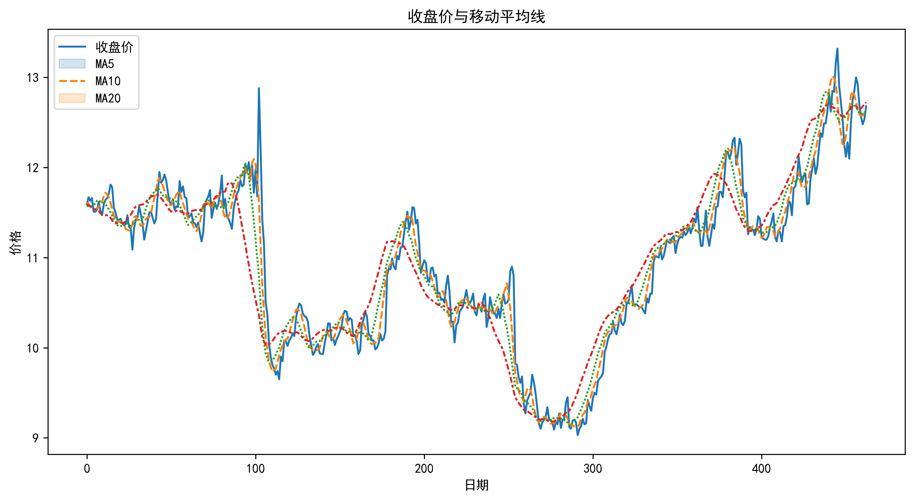

<div align="center">

# 📈 Hybrid Stock Prediction Workbench

**A 股时间序列预测与多模型融合实验**

用 Jupyter Notebook 串联技术指标、LSTM、GRU、SVR、ARIMA、可视化与交互式选股预测。

[](stock_prediction.ipynb)
[](https://www.python.org/)
[](https://keras.io/)
[](https://scikit-learn.org/)

[实验内容](#-实验内容) · [预测流程](#️-预测流程) · [快速开始](#-快速开始) · [文件说明](#-文件说明) · [局限](#️-局限与风险)

</div>

---

## 📖 项目简介

**Hybrid Stock Prediction Workbench** 是一个以 Notebook 为主的股票预测实验仓库。项目提供分片日行情数据、预训练 LSTM / GRU 模型、SVR + ARIMA 基线脚本、技术指标图和多组预测结果，用于探索不同时间序列模型的行为与融合比例。

Notebook 成功运行后会启动交互式界面，可查看可用股票、双击选择标的，并调整模型融合比例生成预测。

> 💡 本仓库更适合作为课程实验和模型对比工作台，而不是可直接用于交易的生产系统。

## ✨ 实验内容

- 🧹 **行情数据预处理** —— 合并分片 CSV，解析交易日期并按股票代码筛选。
- 📊 **技术指标** —— 使用开高低收、成交量、MA5、MA20、RSI 等特征。
- 🧠 **深度时序模型** —— 仓库包含 LSTM 与 GRU 的预训练 `.h5` 模型。
- 📐 **传统模型基线** —— `svm.py` 实现 SVR 与 ARIMA 的训练、评估和 7 日预测。
- ⚖️ **多模型融合** —— 在 GUI 中选择预测结果的融合比例。
- 🖼️ **结果可视化** —— 输出单股票预测、模型比较、未来预测和技术指标图。
- 🪟 **交互式选股** —— Notebook 启动桌面 GUI 选择股票并执行预测。

## 🏗️ 预测流程



## 🛠️ 推荐环境

仓库尚未提供锁定版本的依赖文件。根据现有脚本与模型，建议使用：

- Python 3.10 或 3.11
- JupyterLab / Notebook
- Pandas、NumPy、Matplotlib
- scikit-learn、statsmodels
- TensorFlow / Keras
- Tkinter（通常随桌面版 Python 提供）

示例安装：

```bash
python -m venv .venv
# Windows PowerShell
.\.venv\Scripts\Activate.ps1

python -m pip install --upgrade pip
python -m pip install jupyter pandas numpy matplotlib scikit-learn statsmodels tensorflow
```

> `.h5` 模型可能依赖创建时的 TensorFlow / Keras 版本；遇到反序列化错误时，应优先使用兼容版本重新加载或重新训练。

## 🚀 快速开始

### 1. 克隆仓库

```bash
git clone https://github.com/ZorIgn/prediction.git
cd prediction
```

### 2. 合并行情分片

Linux / macOS / Git Bash：

```bash
cat daily_price_part_* > daily_price.csv
```

Windows CMD：

```bat
copy /b daily_price_part_aa+daily_price_part_ab+daily_price_part_ac+daily_price_part_ad daily_price.csv
```

### 3. 运行 Notebook

```bash
jupyter notebook stock_prediction.ipynb
```

打开 Notebook 后执行全部单元格。模型初始化可能需要数分钟；GUI 出现后：

1. 点击“查看可用股票”。
2. 双击选择股票。
3. 调整融合比例。
4. 执行预测并查看图表。

### 4. 运行 SVR + ARIMA 基线

`svm.py` 当前在 `main()` 中保留了本地硬编码数据路径。运行前请改为实际的 `daily_price.csv`：

```python
if __name__ == "__main__":
    main("daily_price.csv")
```

然后执行：

```bash
python svm.py
```

## 📂 文件说明

| 文件 | 用途 |
| --- | --- |
| `stock_prediction.ipynb` | 主实验、GUI、多模型预测与融合 |
| `svm.py` | SVR + ARIMA 基线、7 日预测与结果导出 |
| `LSTM_stock_model.h5` | 预训练 LSTM 模型 |
| `gru_stock_model.h5` | 预训练 GRU 模型 |
| `daily_price_part_aa` ~ `ad` | 分片日行情数据 |
| `*_predictions.png` | 不同股票的预测示例 |
| `prediction_comparison.png` | 模型预测对比 |
| `technical_indicators.png` | 技术指标示例 |

## 🖼️ 结果示例





## 🧪 复现实验建议

为避免时间序列数据泄漏，继续开发时建议：

- 按时间顺序划分训练集、验证集和测试集；
- 只用训练窗口拟合标准化器；
- 使用 walk-forward / rolling evaluation；
- 报告 MAE、RMSE、MAPE、方向准确率和相对基线提升；
- 固定随机种子，并记录数据区间、特征和模型版本；
- 将 Notebook 中的核心流程拆成可测试 Python 模块。

## ⚠️ 局限与风险

- 仓库没有依赖锁文件、自动化测试和完整训练脚本，预训练模型的精确复现环境需要补充。
- `svm.py` 的滚动预测用占位值模拟未来特征，不能视为生产级多步预测实现。
- 数据与图片是历史实验快照，不能代表当前市场状态。
- 股票价格受大量非平稳因素影响，历史拟合结果不保证未来表现。

本项目仅用于学习和研究，不构成投资建议。
